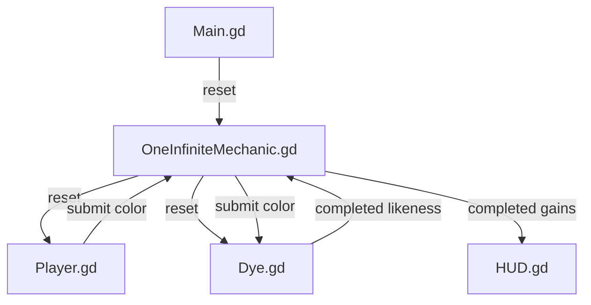

# Comprehensive Project Analysis: Dye my Roots HEX

**Engine:** Godot Engine 3.5 (Config Version 4, GLES2)  
**Target Platform:** Linux / Raspberry Pi Arcade Cabinet (FRT runtime) & PC  
**Genre:** Fast-paced Arcade Color-Matching / Educational Puzzle  

---

## 1. Executive Summary

**Dye my Roots HEX** is a retro arcade puzzle game developed for Global Game Jawn 2023. The player serves as a hair salon assistant for "Ms Kelly", tasked with matching faded hair roots by entering the exact 6-character hexadecimal color code (`#RRGGBB`) under time pressure using arcade carousel controls.

The project features solid arcade fundamentals (procedural audio generation, Animal Crossing-style speech synthesis, reactive UI feedback, and pixel aesthetic). However, the codebase contains several critical gameplay bugs, disconnected systems, math errors in distance/likeness calculations, inefficient texture handling in the dialogue system, and hardcoded scene coupling typical of rapid game-jam development.

---

## 2. Project & Directory Structure

```
dye-my-roots-hex/
├── addons/
│   └── ACVoicebox/                 # Phonetic voice synthesizer addon (Animal Crossing style)
├── components/
│   ├── audio/                      # Multi-stream audio playback utility
│   ├── dialogues/                  # Dialogue rendering & portrait components
│   ├── game/                       # Core gameplay logic (Dye matcher, Player roller, Infinite loop)
│   └── ui/                         # UI widgets (CharRoller, HUD, Landing, UserInfo, AnimatedBackground)
├── dialogs/                        # Dialogue definitions and data structures
├── fonts/                          # Retro/pixel font families (rainyhearts, digital disco, jd_melted, etc.)
├── sounds/                         # SFX (cash register, buzzer, receipt servo, timeout) & BGM
├── sprites/                        # 2D character portraits, hair styles, scenery, shapes
├── themes/                         # UI Theme resources (.tres)
├── Main.tscn / Main.gd             # Core gameplay master scene
├── project.godot                   # Project configuration, Autoloads, GLES2 rendering
└── export_presets.cfg              # Build presets (Raspberry Pi FRT / Linux)
```

### Key Observations:
- **Clean Componentization:** Subsystems are modularly organized into `audio`, `dialogues`, `game`, and `ui`.
- **Reusable Custom Widget:** [CharRoller.gd](file:///home/dorito/Developer/Godot-Projects/dye-my-roots-hex/components/ui/CharRoller.gd) is built as a generic carousel widget used for both hex input and player name entry.
- **Dead / Unlinked Assets:**
  - `dialogs/dialog-test.json`: Unused experimental dialogue file.
  - `components/dialogues/DialogueConsumer.gd`: Unfinished, orphaned script.
  - `components/ui/ArcadeInput.gd`: Intended cabinet input setup, but never linked or registered as an Autoload.

---

## 3. Architecture & Design Patterns

### 3.1 Signal-Up, Call-Down Pattern
The game loop follows Godot's standard hierarchy communication pattern:
- **Downwards:** [Main.gd](file:///home/dorito/Developer/Godot-Projects/dye-my-roots-hex/Main.gd) invokes `reset()` on [OneInfiniteMechanic.gd](file:///home/dorito/Developer/Godot-Projects/dye-my-roots-hex/components/game/OneInfiniteMechanic.gd), which cascades to [Player.gd](file:///home/dorito/Developer/Godot-Projects/dye-my-roots-hex/components/game/Player.gd) and [Dye.gd](file:///home/dorito/Developer/Godot-Projects/dye-my-roots-hex/components/game/Dye.gd).
- **Upwards:** `CharRoller` emits `confirmed` $\rightarrow$ `Player` validates and emits `submit(color)` $\rightarrow$ `Dye` evaluates color distance and emits `completed(likeness)` $\rightarrow$ `OneInfiniteMechanic` calculates dollar gains and emits `completed(gains)` $\rightarrow$ [HUD.gd](file:///home/dorito/Developer/Godot-Projects/dye-my-roots-hex/components/ui/HUD.gd) updates the money display.



### 3.2 Real-time Procedural Audio Generation
In [CharRoller.gd](file:///home/dorito/Developer/Godot-Projects/dye-my-roots-hex/components/ui/CharRoller.gd#L183-L200), an `AudioStreamGenerator` dynamically generates square waves with linear decaying envelopes directly in software for instant UI wheel tick sounds without loading audio files.

### 3.3 Phonetic Dialogue Synthesizer
[addons/ACVoicebox/ACVoicebox.gd](file:///home/dorito/Developer/Godot-Projects/dye-my-roots-hex/addons/ACVoicebox/ACVoicebox.gd) parses dialogue text into phonemes (matching 2-letter digraphs like `th`, `sh` and individual letters), modulating pitch with slight randomness and question-mark inflection.

---

## 4. Critical Bugs & Logic Errors

### 1. Pure Black (`#000000`) Fails Color Validation
- **Location:** [components/game/Player.gd:27-34](file:///home/dorito/Developer/Godot-Projects/dye-my-roots-hex/components/game/Player.gd#L27-L34)
- **Problem:**
  ```gdscript
  func validate_color(new_text):
      var color = Color(new_text)
      var is_valid_color = not color.is_equal_approx(Color.black)
      var has_valid_length = len(new_text) == 6
      return {
          "is_valid": is_valid_color and has_valid_length, 
          "color": color
      }
  ```
  In Godot, `Color(invalid_string)` falls back to `Color(0, 0, 0, 1)` (black). To check whether string parsing failed, the script checks `not color.is_equal_approx(Color.black)`. Consequently, **entering a legitimate black hex `#000000` is rejected as invalid**.
- **Fix:** Validate using Godot's hex checker:
  ```gdscript
  func validate_color(new_text: String) -> Dictionary:
      var is_hex = new_text.is_valid_hex_number(false) and new_text.length() == 6
      var color = Color(new_text) if is_hex else Color.black
      return {
          "is_valid": is_hex,
          "color": color
      }
  ```

---

### 2. Math Error in Likeness Calculation
- **Location:** [components/game/Dye.gd:40-42](file:///home/dorito/Developer/Godot-Projects/dye-my-roots-hex/components/game/Dye.gd#L40-L42)
- **Problem:**
  ```gdscript
  func _ready():
      max_distance = color_distance_rgb(Color.white, Color.black) # sqrt(3) ≈ 1.732

  func submit(color):
      var distance = color_distance_rgb(target, color)
      var likeness = stepify(clamp(range_lerp(distance, 0, 1, 100, 0), 0, 100), 0.1)
  ```
  The Euclidean distance between opposite colors in RGB cube space is $\sqrt{1^2 + 1^2 + 1^2} = \sqrt{3} \approx 1.732$.
  Because `range_lerp` hardcodes max input distance to `1` instead of using `max_distance`, any distance $> 1.0$ is clamped to $0\%$, artificially punishing players on distant color guesses.
- **Fix:**
  ```gdscript
  var likeness = stepify(clamp(range_lerp(distance, 0.0, max_distance, 100.0, 0.0), 0.0, 100.0), 0.1)
  ```

---

### 3. Disconnected Arcade Input Controller (`ArcadeInput.gd`)
- **Location:** [components/ui/ArcadeInput.gd](file:///home/dorito/Developer/Godot-Projects/dye-my-roots-hex/components/ui/ArcadeInput.gd)
- **Problem:**
  `ArcadeInput.gd` binds arcade joypad axes, buttons, and WASD/Space keyboard aliases. However, it is never configured in `project.godot` `[autoload]` and never attached to any scene. As a result, its `_ready()` function never executes.
  Furthermore, `ArcadeInput.gd` defines `ACTION_CONFIRM = "arcade_confirm"`, whereas [CharRoller.gd:144](file:///home/dorito/Developer/Godot-Projects/dye-my-roots-hex/components/ui/CharRoller.gd#L144) and [DialogueSystem.gd:25](file:///home/dorito/Developer/Godot-Projects/dye-my-roots-hex/components/dialogues/DialogueSystem.gd#L25) listen to `"arcade_accept"`.
- **Fix:** Register `ArcadeInput.gd` as an Autoload in `project.godot` and synchronize action names (`arcade_accept`, `arcade_cancel`).

---

### 4. Player Name Discarded on Title Screen
- **Location:** [components/ui/Landing.gd:3-4](file:///home/dorito/Developer/Godot-Projects/dye-my-roots-hex/components/ui/Landing.gd#L3-L4)
- **Problem:**
  The `UserInfo` component allows the player to dial in their name using `CharRoller`, but `Landing.gd` ignores the `name` argument and changes scenes without persisting it anywhere.
- **Fix:** Store player name in a `GameState` singleton for leaderboard / HUD display.

---

## 5. Performance & Code Quality Issues

### 1. Unnecessary Texture & Image Allocation per Dialogue
- **Location:** [components/dialogues/PortraitTexture.gd:6-16](file:///home/dorito/Developer/Godot-Projects/dye-my-roots-hex/components/dialogues/PortraitTexture.gd#L6-L16)
- **Problem:** On every dialogue phrase, `set_emotion` loads the PNG stream texture, calls `get_data()`, locks image memory, creates a brand-new `ImageTexture` via `create_from_image()`, and unlocks it.
- **Improvement:** In Godot, `load("res://...")` already returns a cached, GPU-ready `Texture`. Simply assign `texture = load(emotion_file)` or preload portraits into a dictionary.

---

### 2. Redundant `randomize()` Calls
- **Location:** [components/game/Dye.gd:30](file:///home/dorito/Developer/Godot-Projects/dye-my-roots-hex/components/game/Dye.gd#L30)
- **Problem:** Calling `randomize()` inside `reset()` reseeds the global PRNG on every round.
- **Improvement:** Call `randomize()` once at game launch in `Main.gd` or `Landing.gd`.

---

### 3. Absolute Node Path Coupling (`/root/...`)
- **Location:** [components/dialogues/DialogueSystem.gd:5, 63](file:///home/dorito/Developer/Godot-Projects/dye-my-roots-hex/components/dialogues/DialogueSystem.gd#L5)
- **Problem:** `export var declaration: String = "/root/MissKellyDeclaration"` directly searches `/root/` using string lookup, tightly coupling the component to global Autoload names.
- **Improvement:** Pass dialogue data via custom `Resource` or dependency injection.

---

### 4. Missing Audio Bus Architecture
- **Location:** [components/game/Player.tscn:22](file:///home/dorito/Developer/Godot-Projects/dye-my-roots-hex/components/game/Player.tscn#L22)
- **Problem:** Audio streams are played on the default bus without category attenuation. `InvalidStreamPlayer` has `volume_db = 10.0`, resulting in harsh clipping on arcade speakers.
- **Improvement:** Configure a `default_bus_layout.tres` with `Master`, `Music`, `SFX`, and `Voice` channels.

---

## 6. Target Architecture Recommendation

```
├── autoloads/
│   ├── GameState.gd            # Global state: player_name, money, streak, high_scores
│   ├── InputManager.gd         # Unified joypad & keyboard input mapping
│   └── SoundManager.gd         # Dedicated bus routing & volume balancing
├── resources/
│   ├── DialogueData.gd         # Custom Resource for dialogue scripts
│   └── HairStyleData.gd        # Custom Resource for hair textures & weights
├── scenes/
│   ├── title/                  # Landing screen, attract mode, leaderboard
│   ├── game/                   # Salon gameplay loop
│   └── ui/                     # Reusable widgets (CharRoller, HUD, DialogBox)
```

---

## 7. Actionable Roadmap & Priority Matrix

| Priority | Item | Component | Impact | Effort |
| :--- | :--- | :--- | :--- | :--- |
| 🔴 **Critical** | Fix `#000000` validation rejection | `Player.gd` | Unblocks valid black hex inputs | 5 mins |
| 🔴 **Critical** | Fix likeness formula `max_distance` | `Dye.gd` | Accurate scoring for all colors | 5 mins |
| 🔴 **Critical** | Register `ArcadeInput.gd` as Autoload | `project.godot` | Enables arcade cabinet joypad & WASD keys | 10 mins |
| 🟡 **Medium** | Simplify `PortraitTexture.gd` | `PortraitTexture.gd` | Eliminates memory churn and CPU overhead | 5 mins |
| 🟡 **Medium** | Persist player name via `GameState` | `Landing.gd` / `GameState.gd` | Connects attract screen to gameplay/HUD | 20 mins |
| 🟡 **Medium** | Add Audio Bus layout & normalize volume | Project Settings | Prevents audio clipping on arcade speakers | 15 mins |
| 🟢 **Enhancement**| Add Game Over / High Score Leaderboard | UI / Title | Complete replayable arcade cabinet loop | 1-2 hours |
| 🟢 **Cleanup** | Remove `DialogueConsumer.gd` & unused json | Clean repo | Code hygiene | 2 mins |
